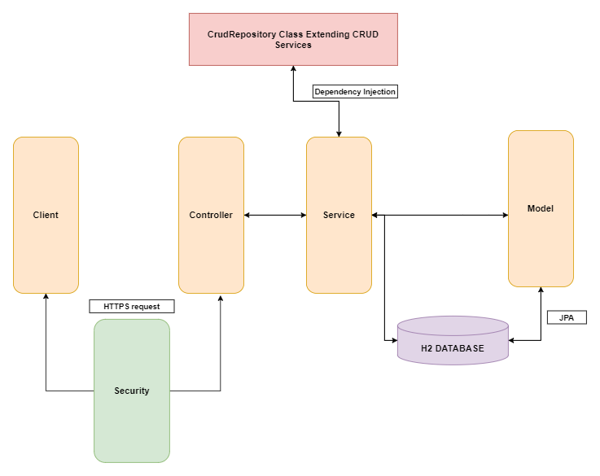

# Imperium

---

Imperium est un logiciel de gestion de projets permettant de gérer ses tâches et ses projets.

L'utilisateur peu ainsi créér des tableaux personalisable auquel il pourra invité, des collaborateurs qui pourront selon les accès qui leurs seront donnée, éditer le tableau, les listes et les tâches, ou alors tout simplement le lire.

# Démarche pour tester le projet

Le projet Imperium est déployé sur _Heroku_.

De fait, il est accessible à l'adresse suivante: <a href="https://imperiums.herokuapp.com/" target="_blank">Imperium.co</a>

## Récupération des sources

Tout les sources du projet sont disponible sur gitlab vous pouvez donc clone le repo :

**Clone avec SSH**

`git clone git@gitlab.com:remiemonet/2022-pwa-a.git`

**OU**

**Clone avec HTTPS**

`https://gitlab.com/remiemonet/2022-pwa-a.git`

# Execution du projet

Le projet peut également être executer via le terminal en suivant ces quelques étapes.

## Création du Build

Il faut tout d'abord générer l'executable pour cela il faut :

1. ce deplacer dans le dossier imperium : `cd imperium`
2. générer l'executable : `mvn clean package`

## Execution

Enfin on peut executer avec : `java -jar /target/*.jar`

 

# Architechture de l'application

L'architechture de notre projet utilise le motif d'architecture MVC (**Modèle-vue-contrôleur**). On pourra donc rettrouver entre autre les packages modele, controller ainsi qu'au d'autre package tel que les package service et repository qui s'inspire du design pattern DAO (**Data-Access-Object**) et qui nous permettent donc de réaliser des actions su notre base de données.

A ce point du projet nous somme en capacité de schématiser les relations de notre application comme suit:

 
