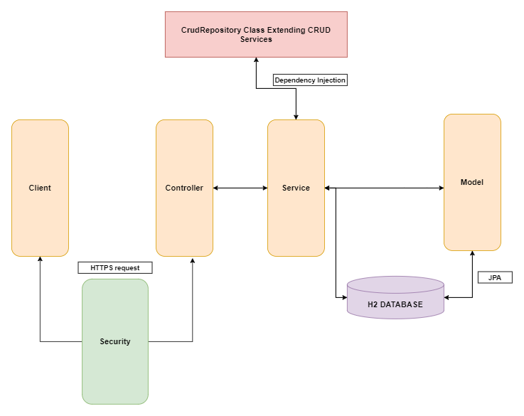
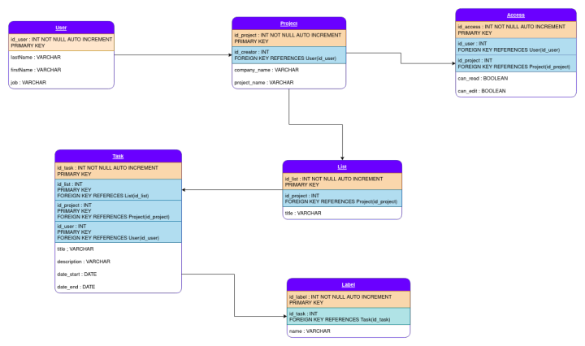

# Imperium

---

Imperium est un outil visuel permettant à votre équipe de gérer vos projets en toute simplicité.

Notre application offre à l'utilisateur la possibilité de créer des tableaux personalisables auxquels il pourra inviter, des collaborateurs qui pourront selon les accès qui leurs sont donnés, éditer le tableau, les listes et les tâches, ou alors tout simplement le lire.


# Setup du projet

 2022-pwa-a/
    ├── frontend/   → Module Frontend avec VueJS
    │   ├── src
    │   ├── public
    │   └── package.json
    └── imperium/   → Module Backend avec Spring Boot
        ├── src
        └── pom.xml

# Démarche pour tester le projet

Le projet Imperium est déployé sur _Heroku_.

De ce fait, il est accessible à l'adresse suivante: <a href="https://imperiums.herokuapp.com/" target="_blank">Imperium.co</a>
Si vous décider de tester le projet en ligne vous pourrez vous connecter avec le compte suivant :

**username :** pwa  
**password :** pwa  

Pour tester le projet en local suivez les étapes ci-dessous.

## Récupération des sources

Tous les sources du projet sont disponibles sur gitlab. Vous pouvez donc clone le repository :

**Clone avec SSH**

```
git clone git@gitlab.com:remiemonet/2022-pwa-a.git
```

**OU**

**Clone avec HTTPS**

```
https://gitlab.com/remiemonet/2022-pwa-a.git
```

Les sources se trouvent dans le dossier imperium. Les ressources telles que les images utilisées pour rédiger se readme se trouvent dans le dossier docs, dans lequelle on pourra également retrouver les éléments de design constituant notre application.

# Exécution du projet

Le projet peut également être executé via le terminal en suivant ces quelques étapes:

## Création du Build

Il faut tout d'abord générer l'exécutable du backend. Pour cela il faut :

1. se déplacer dans le dossier imperium : 
```
cd imperium
```
2. générer l'exécutable : 
```
mvn clean package
```

## Execution

On peut exécuter le Backend avec : 
```
java -jar /target/*.jar
```

Pour le frontend : 

Dans le terminal, il faut se mettre dans le dossier /frontend/src, puis lancer les commandes suivantes :

 1.  Pour installer toutes les dépendances depuis le fichier "package.json" :
 ```
  npm install
 ```
 2. Pour lancer le serveur de VueJS sur le port 3000 :
  ```
  npm run serve
   ```

</br>

# Architecture de l'application

L'architechture de notre projet utilise le motif d'architecture MVC (**Modèle-vue-contrôleur**). On pourra donc retrouver -entre autres- les packages model, controller ainsi que d'autres packages tels que 'service' et 'repository' qui s'inspire du design pattern DAO (**Data-Access-Object**). Ceux-ci nous permettent de réaliser des actions sur notre base de données.

À ce point du projet nous sommes en capacité de schématiser les relations de notre application comme suit:



</br>

## Schéma de la base de données

Notre base de données se présente sous le schéma suivant :
</br>

